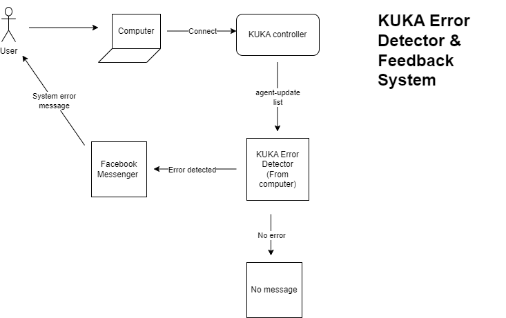

# KUKA Error Detector

- **Product**:
	- **Develop a small monitoring tool that:**
		- Runs on my computer
		- Detector can easily start via the CLI
		- Regularly sends an `update-agent list` command to the KUKA controller and notifies if there are changes to the KUKA Linux OS, Bundles or Firmware
		- It also notifies if the controller is not reachable
    - **The notification is based on Telegram**
		- [Telegram Bot API](https://core.telegram.org/bots/api)
		- [GitHub - go-telegram-bot-api/telegram-bot-api: Golang bindings for the Telegram Bot API](https://github.com/go-telegram-bot-api/telegram-bot-api)
		- [GitHub - python-telegram-bot/python-telegram-bot: We have made you a wrapper you can't refuse](https://github.com/python-telegram-bot/python-telegram-bot)

## note update